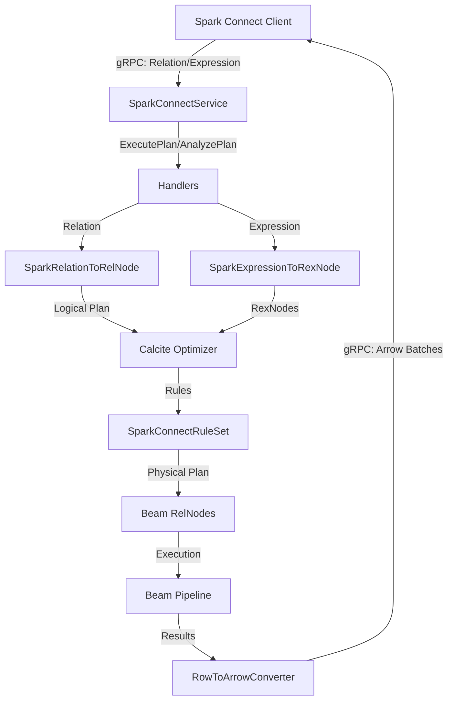

<!--
    Licensed to the Apache Software Foundation (ASF) under one
    or more contributor license agreements.  See the NOTICE file
    distributed with this work for additional information
    regarding copyright ownership.  The ASF licenses this file
    to you under the Apache License, Version 2.0 (the
    "License"); you may not use this file except in compliance
    with the License.  You may obtain a copy of the License at

      http://www.apache.org/licenses/LICENSE-2.0

    Unless required by applicable law or agreed to in writing,
    software distributed under the License is distributed on an
    "AS IS" BASIS, WITHOUT WARRANTIES OR CONDITIONS OF ANY
    KIND, either express or implied.  See the License for the
    specific language governing permissions and limitations
    under the License.
-->

# Spark Connect in Beam: Functional Areas Breakdown

This document provides a comprehensive breakdown of the functional areas within the `sparkconnect/` directory. It explains how Spark Connect is implemented on top of Apache Beam using Apache Calcite, maps these areas to PySpark compliance test categories, and identifies key components.

---

## 1. Core Architecture & Infrastructure

This area covers the foundation of the Spark Connect server, including gRPC communication, session lifecycle, and client configuration.

*   **Description**: Spark Connect uses a gRPC protocol to allow thin clients (like the PySpark shell or applications) to interact with a Spark server. In this implementation, the server is replaced by a Beam-based service that translates Spark commands into Beam pipelines.
*   **Key Components**:
    *   `SparkConnectServer.java`: The entry point that starts the gRPC server.
    *   `SparkConnectService.java`: Implements the Spark Connect gRPC service (`SparkConnectServiceGrpc.SparkConnectServiceImplBase`). It receives RPCs like `ExecutePlan`, `AnalyzePlan`, `Config`, etc., and delegates them to specific handlers.
    *   `org.apache.beam.sparkconnect.handler.*`: Handlers for individual gRPC methods:
        *   `ConfigHandler.java`: Manages session configurations (get, set, unset).
        *   `ReleaseSessionHandler.java`: Handles session termination.
        *   `AddArtifactsHandler.java` & `ArtifactStatusHandler.java`: Manage adding client-side resources (JARs, files) to the server environment.
*   **Originating Components**:
    *   `connector/connect/server/src/main/scala/org/apache/spark/sql/connect/service/SparkConnectService.scala`: The main entry point starting the gRPC server in Spark.
    *   `connector/connect/server/src/main/scala/org/apache/spark/sql/connect/service/SparkConnectServiceImpl.scala`: Implements gRPC interface methods (`executePlan`, `analyzePlan`, `config`, `addArtifacts`, `artifactStatus`, `releaseSession`).
    *   `connector/connect/server/src/main/scala/org/apache/spark/sql/connect/service/SparkConnectSessionManager.scala`: Manages the session lifecycle and contexts.
*   **Compliance Mapping**:
    *   `sql/client`: Verifies basic client connection and session management.
    *   `sql/shell`: Tests interaction via the interactive shell.
*   **Current Status**: Mostly functional for basic session lifecycle, but advanced artifact handling might have gaps.

---

## 2. Query Translation Engine (The Core)

This is the heart of the implementation, bridging the Spark Connect protocol and the Apache Beam execution model.

*   **Description**: Translates the Spark Connect logical plan (represented as a protobuf `Relation` tree) and Spark expressions (protobuf `Expression`) into Apache Calcite `RelNode` and `RexNode` trees. These are then optimized and converted into Beam-specific physical relations, which are ultimately executed as a Beam pipeline.
*   **Key Components**:
    *   `SparkRelationToRelNode.java`: The main translator class. It contains a massive `switch` statement over all Spark `Relation` types, converting them to Calcite `RelNode`s (either standard Calcite nodes or custom logical nodes).
    *   `SparkExpressionToRexNode.java`: Translates Spark expressions (e.g., column references, literals, functions) into Calcite `RexNode`s.
    *   `SparkDataTypeToRelDataType.java` & `RelDataTypeToSparkDataType.java`: Handle type mapping between Spark and Calcite/Beam.
    *   `org.apache.beam.sparkconnect.rel.*`: Custom *logical* Calcite relations for Spark operations that don't map directly to standard Calcite (e.g., `LogicalShowString`, `LogicalMapPartitions`).
    *   `org.apache.beam.sparkconnect.rule.*`: Calcite rules (e.g., `BeamShowStringRule`) that translate logical relations to physical Beam relations.
    *   `org.apache.beam.sparkconnect.beamrel.*`: Custom *physical* Calcite relations that represent Beam execution steps (e.g., `BeamShowString`).
*   **Originating Components**:
    *   `connector/connect/server/src/main/scala/org/apache/spark/sql/connect/planner/SparkConnectPlanner.scala`: The primary translator converting Spark Connect's protobuf `Relation` and `Expression` trees to Spark Catalyst `LogicalPlan` and `Expression` nodes.
    *   `sql/catalyst/src/main/scala/org/apache/spark/sql/catalyst/plans/logical/LogicalPlan.scala`: The base class for logical operators in Spark Catalyst.
    *   `sql/catalyst/src/main/scala/org/apache/spark/sql/catalyst/expressions/Expression.scala`: The base class for Spark Catalyst expressions.
*   **Compliance Mapping**:
    *   This engine supports all `sql` and `pandas` compliance categories by providing the underlying translation.
*   **Current Status**: The framework is in place, but many specific relation types and expressions either throw `UnsupportedOperationException` or have limited translation logic. This is the primary area requiring ongoing compliance work.

---

## 3. Core DataFrame Operations (Batch)

This area covers standard batch transformations applied to DataFrames.

*   **Description**: Classic relational operations like projection (select), filtering (where), joins, aggregations (groupBy), and sorting.
*   **Key Components**:
    *   `SparkRelationToRelNode.java` methods:
        *   `translateProject`: Translates `Project` relation to `LogicalProject`.
        *   `translateFilter`: Translates `Filter` relation to `LogicalFilter`.
        *   `translateJoin`: Translates `Join` relation to `LogicalJoin` (supports Inner, Left/Right/Full Outer, Semi, Anti, Cross joins).
        *   `translateAggregate`: Translates `Aggregate` (groupBy + agg) to `LogicalAggregate`.
        *   `translateSort`: Translates `Sort` (orderBy) to `LogicalSort`.
        *   `translateSetOp`: Translates `SetOperation` (Union, Intersect, Except).
        *   `translateLimit` & `translateOffset`: Handle limit and offset.
        *   `translateDeduplicate`: Translates `Deduplicate` (distinct).
*   **Originating Components**:
    *   `sql/catalyst/src/main/scala/org/apache/spark/sql/catalyst/plans/logical/basicLogicalOperators.scala`: Defines the fundamental relational operators (`Project`, `Filter`, `Join`, `Aggregate`, `Sort`, `Limit`, etc.) optimized by Spark Catalyst.
    *   `sql/core/src/main/scala/org/apache/spark/sql/Dataset.scala`: The user-facing DataFrame API in Spark Core which constructs logical plan trees.
*   **Compliance Mapping**:
    *   `sql` (Base): Core DataFrame API tests.
*   **Current Status**: Basic operations are supported, but complex edge cases, specific join types (e.g., `AsOfJoin`), and complex window functions are likely incomplete.

---

## 4. I/O and Data Sources

This area covers reading from and writing to external storage systems.

*   **Description**: Support for reading data from files (CSV, JSON, Parquet, ORC) and writing results back. It includes schema parsing and inference.
*   **Key Components**:
    *   `SparkRelationToRelNode.java` methods:
        *   `translateRead`: Handles `Read` relations.
        *   `translateReadDataSource`: Currently supports `csv` and `json` formats by registering external tables in the Beam SQL environment.
        *   `parseDataSourceSchema`: Parses DDL or JSON representations of schemas.
    *   *Gaps*: `translateReadNamedTable` is currently unsupported. Parquet/ORC support seems limited or missing in the main translator path.
*   **Originating Components**:
    *   `sql/core/src/main/scala/org/apache/spark/sql/DataFrameReader.scala`: Handles user requests for reading files/tables and builds the logical `Read` relations.
    *   `sql/core/src/main/scala/org/apache/spark/sql/DataFrameWriter.scala`: Handles writing datasets (`WRITE_OPERATION`) to target sinks.
    *   `sql/core/src/main/scala/org/apache/spark/sql/execution/datasources/`: Core package containing standard Spark file formats and Data Source V1/V2 integrations (e.g., parquet, csv, json, orc).
*   **Compliance Mapping**:
    *   `sql` subcategories related to I/O (e.g., `sql/parquet` if it existed as a separate category, though it's often folded into base SQL).
*   **Current Status**: **Low compliance**. Only basic CSV/JSON reads with explicit schemas are implemented. Parquet and generic data source support are major gaps.

---

## 5. User-Defined Functions (UDFs & UDTFs)

This area covers executing custom user code (typically Python in PySpark) within the Beam pipeline.

*   **Description**: Spark Connect allows users to define UDFs (scalar functions) and UDTFs (table-generating functions) in Python, which must be executed on the server.
*   **Key Components**:
    *   `SparkRelationToRelNode.java` methods:
        *   `translateMapPartitions`: Handles `MapPartitions` relation (often used for Pandas UDFs). It creates a `LogicalMapPartitions` node.
        *   `translateCommonInlineUserDefinedTableFunction`: Placeholder for UDTFs.
    *   `LogicalMapPartitions.java` & `BeamMapPartitions.java`: Represent the UDF execution step.
*   **Originating Components**:
    *   `core/src/main/scala/org/apache/spark/api/python/PythonRunner.scala`: Manages spawning and communicating with standard Python UDF subprocesses via input/output streams.
    *   `sql/core/src/main/scala/org/apache/spark/sql/execution/python/ArrowPythonRunner.scala`: Leverages Apache Arrow to efficiently stream partitioned batch data between the JVM and PySpark workers.
    *   `core/src/main/scala/org/apache/spark/api/python/PythonWorkerFactory.scala`: Spawns and manages local/remote daemon processes running the Python workers.
    *   `python/pyspark/worker.py`: The Python worker script executed in the spawned subprocess that deserializes Python UDF bytecode, reads input datasets, executes user UDF code, and writes output streams back to the JVM.
    *   `python/pyspark/daemon.py`: A persistent local daemon process listening on a socket to fork new Python workers to avoid subprocess startup overhead.
    *   `sql/catalyst/src/main/scala/org/apache/spark/sql/catalyst/expressions/ScalaUDF.scala`: Represents and executes JVM-native Java and Scala UDFs directly in the Spark JVM (using reflection or dynamically generated bytecode) without subprocess overhead.
    *   `sql/catalyst/src/main/scala/org/apache/spark/sql/catalyst/expressions/generators.scala`: Represents and executes JVM-native Java/Scala generators (UDTFs) that produce multiple rows.
*   **Compliance Mapping**:
    *   `errors`: Tests often verify UDF error tracebacks.
    *   `sql` (UDF-related tests).
*   **Current Status**: **Very limited**. Only Python UDFs in `MapPartitions` are partially supported. General UDF/UDTF integration (especially propagating Python environments to Beam workers) is a highly complex area with significant gaps.

---

## 6. Structured Streaming

This area covers processing real-time data streams.

*   **Description**: Extending the DataFrame API to support streaming sources, windowing, watermarks, and stateful processing.
*   **Key Components**:
    *   `SparkRelationToRelNode.java` methods:
        *   `translateWithWatermark`: Handles watermark definition.
        *   `translateApplyInPandasWithState`: Stateful processing in Pandas.
    *   *Gaps*: `Read.getIsStreaming()` currently throws `UnsupportedOperationException`.
*   **Originating Components**:
    *   `sql/core/src/main/scala/org/apache/spark/sql/execution/streaming/MicroBatchExecution.scala`: The primary engine driving micro-batch query execution, triggers, offsets, and metadata logging.
    *   `sql/core/src/main/scala/org/apache/spark/sql/execution/streaming/IncrementalExecution.scala`: A specialized physical query planner for planning stateful, incremental, and windowed operators.
    *   `sql/core/src/main/scala/org/apache/spark/sql/execution/streaming/StreamingQueryManager.scala`: Orchestrates the lifecycle of active streaming queries in a session.
*   **Compliance Mapping**:
    *   `sql/streaming`: Structured Streaming tests.
    *   `sql/pandas/streaming`: Streaming with Pandas UDFs.
*   **Current Status**: **Almost no compliance (0-20%)**. Streaming reads are explicitly blocked. This requires significant architectural work to bridge Spark's streaming model with Beam's windowing and triggers.

---

## 7. Machine Learning (MLlib) Extensions

This area covers distributed machine learning algorithms and model execution mechanisms.

*   **Description**: Spark Connect encapsulates ML operations as protobuf extensions inside `google.protobuf.Any` messages within both logical relations and executable commands.
*   **Key Components**:
    *   `SparkRelationToRelNode.java` methods:
        *   `translateExtension`: Intercepts ML extension relations and routes them to specific logical stubs.
        *   `translateMlTransform`: Stub for applying fitted models (`ModelTransform`).
        *   `translateMlFetch`: Stub for fetching metrics or summary statistics (`Summarizer`).
        *   `translateMlWrite` & `translateMlRead`: Stubs for model/estimator persistence.
*   **Originating Components**:
    *   `connector/connect/server/src/main/scala/org/apache/spark/sql/connect/ml/MLHandler.scala`: Main server interceptor that handles ML Command extensions (e.g., model fitting and model evaluation).
    *   `connector/connect/server/src/main/scala/org/apache/spark/sql/connect/ml/Serializer.scala`: Implements server-side serialization/deserialization of estimators, transformers, models, and evaluations.
    *   `mllib/src/main/scala/org/apache/spark/ml/`: Core distributed machine learning algorithms and API contracts (e.g., Predictor, classification, regression, clustering, feature transformers).
*   **Compliance Mapping**:
    *   `ml` (All subcategories: classification, clustering, evaluation, feature, tuning, caching).
*   **Current Status**: **No compliance (0%)**. Logic is currently stubbed out to throw explicit `UnsupportedOperationException`s recording the extension Type URLs. Implementing this requires unpacking model parameters and mapping execution steps onto Beam-native inference patterns (e.g., `RunInference`).

---

## 8. ML Pipelines Sub-Language

This area covers the construction, training, and execution of multi-stage machine learning workflows.

*   **Description**: Chaining multiple ML estimators and feature transformers together into directed acyclic workflows, including automated hyperparameter search.
*   **Key Components**:
    *   `pipelines.proto`: Defines the pipeline-specific structures.
    *   Stubs in `SparkRelationToRelNode.java` handling pipeline extension relations.
*   **Originating Components**:
    *   `mllib/src/main/scala/org/apache/spark/ml/Pipeline.scala`: Implements estimators, transformers, and trained models constructed from chains of algorithms.
    *   `mllib/src/main/scala/org/apache/spark/ml/tuning/CrossValidator.scala` & `TrainValidationSplit.scala`: Implement model selection, tuning, and hyperparameter search strategies.
*   **Compliance Mapping**:
    *   `ml` pipeline-specific tests (e.g., `test_connect_pipeline.py`, `test_connect_tuning.py`).
*   **Current Status**: **No compliance (0%)**. Requires orchestrating multi-stage stage chaining, maintaining schemas across intermediate transformations, and executing distributed hyperparameter evaluation (e.g., `CrossValidator`) on Beam workers.

---

## 9. Pandas API on Spark Compatibility

This area covers the compatibility layer that allows Pandas code to run on the Spark Connect backend.

*   **Description**: PySpark provides a Pandas-compatible API (`pyspark.pandas`). This API translates Pandas operations into Spark Connect plans.
*   **Key Components**:
    *   This area doesn't have many *exclusive* Java classes, as it relies heavily on the Core DataFrame API (Area 3) and UDFs (Area 5).
    *   However, it often generates specific plan patterns (like complex projections, window functions, and `MapPartitions`) that the translation engine must handle.
*   **Originating Components**:
    *   `python/pyspark/pandas/internal.py`: Implements `InternalFrame`, the primary structural bridge mapping PySpark Pandas concepts onto Spark Catalyst logical structures.
    *   `python/pyspark/pandas/frame.py` & `python/pyspark/pandas/series.py`: High-level Pandas-compatible user APIs that translate calls to Spark Connect query plans.
*   **Compliance Mapping**:
    *   `pandas` (all subcategories: `computation`, `data_type_ops`, `series`, `frame`, etc.).
*   **Current Status**: **Low compliance** (varies from 0% to 30% depending on subcategory). It is highly dependent on the completeness of the Core SQL and UDF support.

---

## 10. Diagnostics, Logging & Error Handling

This area covers observability, debugging, and error propagation.

*   **Description**: Ensuring that errors occurring during Beam execution are correctly reported back to the PySpark client with useful tracebacks, and that logging is consistent.
*   **Key Components**:
    *   `LoggingInterceptor.java`: Likely intercepts gRPC calls for logging.
    *   `FetchErrorDetailsHandler.java`: Handles the `FetchErrorDetails` RPC, which clients call to get detailed tracebacks when a query fails.
*   **Originating Components**:
    *   `common/utils/src/main/resources/error/error-classes.json`: Source repository of all Spark structured error templates.
    *   `core/src/main/scala/org/apache/spark/SparkThrowable.scala`: Class interface providing clean error categorization.
    *   `connector/connect/server/src/main/scala/org/apache/spark/sql/connect/service/SparkConnectServiceImpl.scala`: Serializes exception tracebacks and metadata for the JVM backend, returning structured error details to PySpark thin clients.
*   **Compliance Mapping**:
    *   `errors`: Traceback verification.
    *   `logger`: Logging behavior verification.
*   **Current Status**: Partially implemented. The `FetchErrorDetailsHandler` exists but its completeness in capturing and formatting Beam-side errors to match Spark expectations is a key compliance task.

---

## Summary of Compliance Gaps & Effort

| Area | Estimated Compliance | Effort to Complete | AI Ease | Key Challenges |
| :--- | :---: | :---: | :---: | :--- |
| **1. Core Infra** | High (~80%) | S | High | Minor protocol details. |
| **2. Query Engine** | Medium (~40%) | XL | Low | Deep Calcite rule mapping, expression coverage. |
| **3. Core DataFrame** | Medium (~50%) | L | Medium | Complex joins, window functions, type edge cases. |
| **4. I/O** | Low (<20%) | L | Medium | Parquet/ORC support, file system integration. |
| **5. UDFs/UDTFs** | Low (<10%) | XL | Low | Python environment execution on Beam workers. |
| **6. Streaming** | Very Low (<5%) | XL | Low | Bridging streaming execution models. |
| **7. MLlib Extensions** | None (0%) | XL | Low | Translating ML extensions to Beam-native RunInference or PTransforms. |
| **8. ML Pipelines** | None (0%) | XL | Low | Chaining estimators/transformers into DAGs, managing intermediate schemas. |
| **9. Pandas API** | Low (~15%) | XL | Medium | Relies on Core SQL and UDFs; complex plan patterns. |
| **10. Diagnostics** | Medium (~50%) | M | High | Aligning traceback formats, logging context. |
