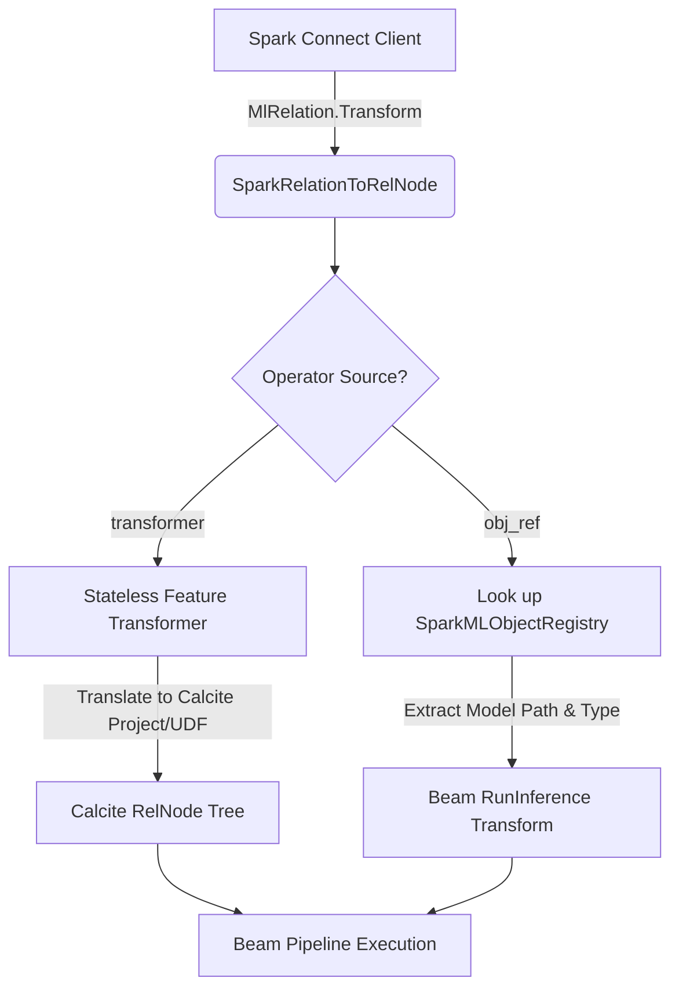

# Spark MLlib Operators inside `translateMlTransformRelation`

This document provides a comprehensive architectural breakdown of the possible Spark MLlib operators (Transformers and Fitted Models) that can be applied inside `translateMlTransformRelation` and details how they can be mapped to Apache Beam execution structures.

---

## 1. Structure of `MlOperator`

In Spark Connect's protobuf messages (`ml_common.proto`), an **`MlOperator`** is represented by:
- **`name` (String)**: The fully qualified or short class name of the Spark ML operator (e.g., `"org.apache.spark.ml.feature.VectorAssembler"` or `"LogisticRegressionModel"`).
- **`uid` (String)**: A unique identifier generated for the operator instance (e.g., `"VectorAssembler_abc123"`).
- **`params` (`MlParams`)**: A map of hyperparameters or configurations (e.g., input columns, output columns, threshold, etc.).

---

## 2. Types of Operators in `translateMlTransformRelation`

In Spark MLlib, operators applied during relational transformation fall into two primary categories:

### A. Feature Transformers (No Registry State Required)
These operators do not require state fitting; they are stateless mathematical or rule-based transformations. Spark Connect sends them as part of `MlRelation.Transform` with the `transformer` field populated directly.

| Spark ML Operator Class | Purpose | Beam/Calcite Translation Strategy |
| :--- | :--- | :--- |
| **`VectorAssembler`** | Combines multiple feature columns into a single vector column. | Translate to a Calcite project expression that packages values into a Beam array or custom Row type. |
| **`Tokenizer`** | Splits text columns into arrays of word tokens. | Map to a standard SQL/Calcite string splitting function or a simple Beam UDF. |
| **`HashingTF`** | Converts tokens to term-frequency sparse vectors. | Map to a Beam `PTransform` that hashes string tokens. |
| **`Binarizer`** | Thresholds numerical features to binary values. | Translate to a Calcite `CASE WHEN col > threshold THEN 1.0 ELSE 0.0 END` SQL projection. |

---

### B. Fitted Models (Require Server-Side Registry Lookup)
These operators represent models that have been trained (`Fit`) or loaded from disk (`Read`). Because they carry weight matrices, coefficients, or cluster centers, the Spark client registers them and references them during inference using an `ObjectRef`.

| Spark ML Model Class | Spark Estimator | Prediction Output | Beam RunInference Model Handler |
| :--- | :--- | :--- | :--- |
| **`LogisticRegressionModel`** | `LogisticRegression` | Class probabilities and prediction index. | **`PyTorchModelHandler`** / **`TensorFlowModelHandler`** / **`ONNXModelHandler`** loaded from the registered `path`. |
| **`LinearRegressionModel`** | `LinearRegression` | Continuous numerical prediction value. | Linear equation evaluation directly in Calcite or via a lightweight `ModelHandler`. |
| **`KMeansModel`** | `KMeans` | Predicted cluster index. | Cluster distance computation UDF. |
| **`RandomForestClassificationModel`** | `RandomForestClassifier` | Class probabilities and prediction. | XGBoost / Scikit-Learn model inference. |

---

## 3. Execution Pipeline in Apache Beam

When translating these operators to run on the Apache Beam engine, the translation layer maps them as follows:

1. **Stateless feature transformations** are compiled directly into **Calcite logical expressions** (such as project and filter nodes) for maximum speed and standard SQL runner execution.
2. **Fitted models** are translated to use **Beam's RunInference API**, passing the registered model `path` and `operatorName` to initialize the appropriate framework model handler (e.g. PyTorch, TensorFlow, or ONNX) for high-performance distributed scoring.
